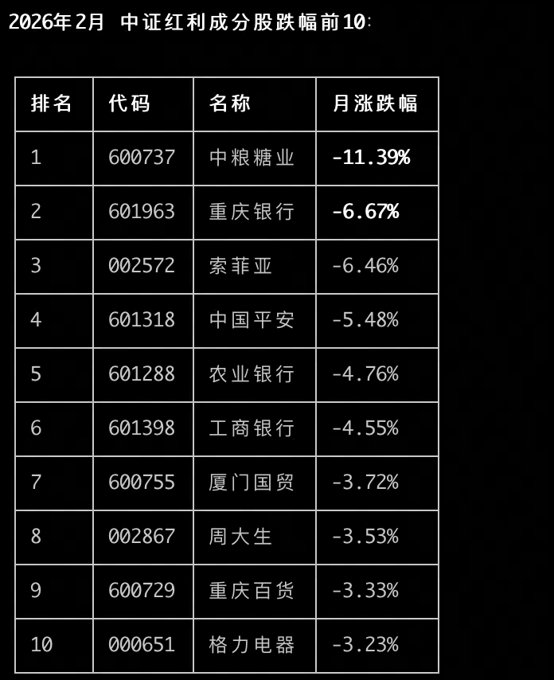
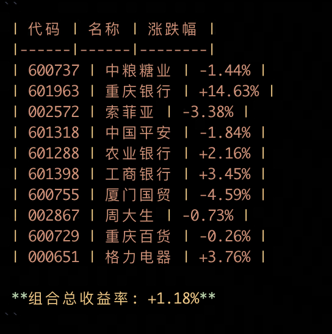

# 🎯 Agent Skills

> 这是一个可扩展的 Agent Skills 集合，让你的 AI 助手拥有更多实用技能。

## 📦 已安装的 Skills

### 📈 china-red-chip-monthly
**中证红利成分股月度表现查询**

- 查询中证红利指数（sh000922）成分股在某月份的表现
- 使用官方100只成分股列表
- 按跌幅排序，输出前10只股票
- 涨跌幅计算：上月收盘价 → 月末收盘价

```bash
python3 scripts/monthly_performance.py 2026-02
```

**效果截图：**



---

### 📊 stock-backtest
**股票组合回测工具**

- 根据股票代码列表和日期范围进行回测
- 计算等权配置组合的总收益率
- 支持任意数量股票组合

```bash
python3 scripts/backtest.py "600737,601963,002572" 2026-03-02 2026-03-13
```

**效果截图：**



---

## 🚀 如何使用

1. 克隆仓库到本地
2. 将 Skills 复制到你的 Agent 配置目录
3. 通过自然语言调用 Skills

## 🔧 自定义 Skills

这个仓库设计为可扩展的。你可以通过以下方式添加新的 Skills：

1. 在 `skills/` 目录下创建新的 Skill 文件夹
2. 编写 `SKILL.md` 作为 Skill 的说明文档
3. 在 `scripts/` 目录下添加执行脚本
4. 提交 Pull Request 或自行使用

## 📚 数据来源

- 股票行情：[新浪财经API](https://finance.sina.com.cn/)
- 成分股：中证红利指数官方文件

## ⚙️ 环境依赖

```bash
pip install pandas openpyxl requests
```

---

> 💡 **提示**：如果你有其他领域的 Skills想要分享，欢迎提交贡献！
